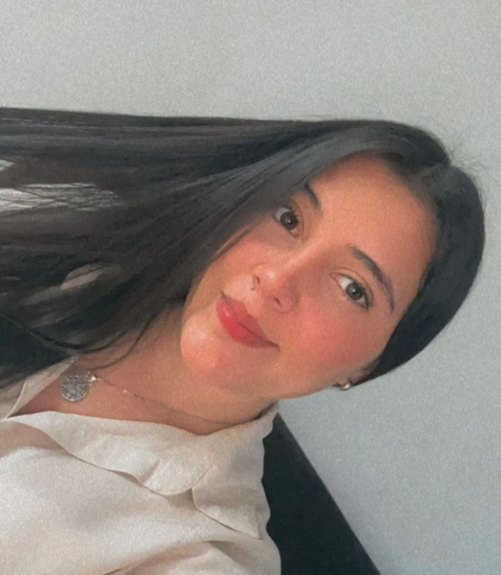

# ¡Bienvenido a mi espacio digital, donde la salud se fusiona con la tecnologia!

## VALENTINA VARGAS DElGADO

### Estudiante de Ingeniería en Sistemas y Telecomunicaciones | Técnica en Auxiliar de Enfermería

### Manizales, Colombia

-----

## Sobre mí

Técnica laboral en auxiliar de enfermería y estudiante de Ingeniería en Sistemas y Telecomunicaciones de 6to semestre, con un perfil profesional que integra competencias de salud y tecnología.

Profesional proactiva con sólidas habilidades de **liderazgo**, **trabajo en equipo** y **comunicación**. Me caracterizo por mi **puntualidad**, **responsabilidad** y **compromiso laboral**, combinando un enfoque técnico preciso con una actitud de servicio excepcional, capaz de abordar desafíos interdisciplinarios con eficacia, adaptabilidad y creatividad.

-----

## Frase que me inspira

> *“El secreto de la felicidad es simple: descubre qué es lo que verdaderamente amas, dirige tu vida hacia ello y sé disciplinada, pues la disciplina es el puente entre quien eres hoy y quien quieres ser mañana.”* -INSPIRADO EN ROBIN SHARMA (El monje que vendio su ferrari)

-----

## Tecnologías que estoy aprendiendo

-----

## Donde estudio

-----

## Mis proyectos

- 🔗 [Ejercicios HTML - GitLab](https://gitlab.com/valentinaejercicios/ejercicios-html)
- 🔗 [Ejercicios HTML Pares - GitHub](https://github.com/Valentinavvd/ejercicios-html-pares)

-----

## Encuéntrame en

-----

##  Mis objetivos

-  Seguir adquiriendo nuevos conocimeintos en desarrollo web y nuevas tecnologías
-  Integrar mis conocimientos en salud y tecnología para crear soluciones innovadoras
-  Colaborar en proyectos interdisciplinarios que generen impacto positivo
